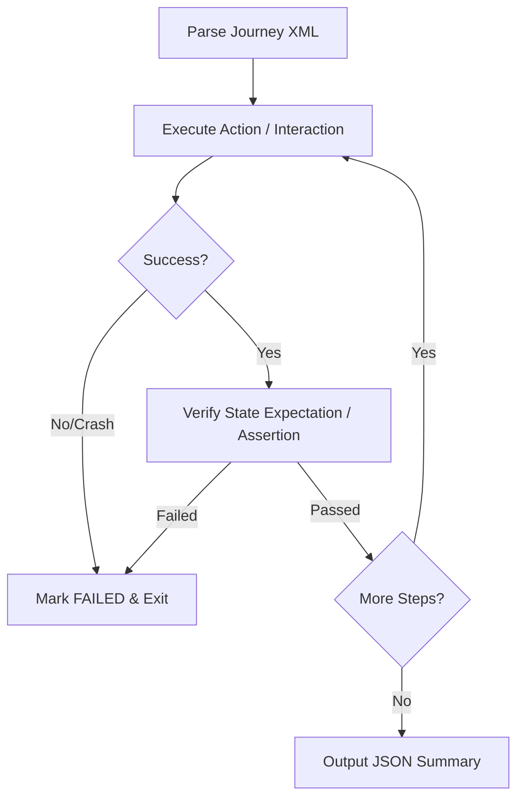

# Android UI Journey Testing

## Overview

This skill outlines the standard workflow for running XML-specified User Journey tests on Android applications. A "journey" is a sequenced set of user actions and state assertions designed to verify end-to-end functionality. The journey XML acts as the source of truth for the app's behavior. The executor proceeds sequentially, performing UI interactions, checking state assertions, and writing a standardized JSON outcome report.

## When to Use

- Use when evaluating an Android application's UI behavior against an XML test specification.
- Use when automating multi-step user flows (e.g., login, checkout, navigation) and verifying expectations.
- Use when running verification tests and generating standardized JSON test reports.
- Use when debugging application flows on physical devices or emulators using ADB commands.

## How It Works



### Step 1: Parse the Journey Specification
Read and parse the XML test suite structure. The root node `<journey>` defines the test case name, and the `<actions>` block contains the sequence of test steps.

```xml
<journey name="Search and Cart Flow">
   <description>Verify that searching for an item and adding it to the cart succeeds.</description>
   <actions>
      <action>Search for soda</action>
      <action>Tap the first search result</action>
      <action>Verify that the product detail screen is shown</action>
   </actions>
</journey>
```

### Step 2: Sequential Step Evaluation
Process each `<action>` element in the exact order specified. Test steps are classified into two groups:

#### A. Interactive Actions (Taps, Swipes, Text Input)
Perform the physical UI interaction using ADB.
- **Tapping**: Tap the center of the target element's bounds:
  ```bash
  adb shell input tap <x> <y>
  ```
- **Swiping/Scrolling**: Swipe from coordinate to coordinate with a duration:
  ```bash
  adb shell input swipe <x1> <y1> <x2> <y2> <duration_ms>
  ```
- **Text Typing**: Type text into the active input field:
  ```bash
  adb shell input text "<string>"
  ```
If the element is missing or the action cannot be performed, the action and the journey fail.

#### B. State Assertions (Expectation Verification)
Steps beginning with "verify", "check", or "ensure" represent state assertions. 
- Inspect the current screen (using screenshots or `uiautomator dump`) without interacting or scrolling.
- Confirm all sub-assertions are met. For example, *"Verify that the app is on the Home screen and the logo is visible"* fails if the home screen is not displayed **or** the logo is missing.

### Step 3: Handle Failures and Crashes
If the application crashes, exits, freezes, or fails an assertion:
1. Immediately stop journey execution.
2. Mark the failed step as `FAILED`.
3. Mark any subsequent steps as `SKIPPED`.
4. Document the exact reason for failure.

### Step 4: Generate JSON Report
Format the execution results into a standardized JSON schema and write it to the output log.

---

## Examples

### Example 1: Full Journey XML Specification

```xml
<journey name="Login and Profile Edit">
   <description>Logs into the app, navigates to settings, and changes user profile information.</description>
   <actions>
      <action>Verify that the username input field is visible</action>
      <action>Tap the username input field</action>
      <action>Type "testuser" into the input</action>
      <action>Tap the password input field</action>
      <action>Type "password123" into the input</action>
      <action>Tap the "Login" button</action>
      <action>Verify that the Home dashboard is visible and user profile photo is shown</action>
   </actions>
</journey>
```

### Example 2: Standard JSON Outcome Report

```json
{
  "journey": "Login and Profile Edit",
  "results": [
    {
      "action": "Verify that the username input field is visible",
      "status": "PASSED",
      "commands": [],
      "comment": "Username input detected at bounds [100,200][980,300] via UI dump."
    },
    {
      "action": "Tap the username input field",
      "status": "PASSED",
      "commands": [
        "adb shell input tap 540 250"
      ],
      "comment": "Tapped center coordinates of username input."
    },
    {
      "action": "Type \"testuser\" into the input",
      "status": "PASSED",
      "commands": [
        "adb shell input text \"testuser\""
      ],
      "comment": "Username typed successfully."
    },
    {
      "action": "Tap the password input field",
      "status": "PASSED",
      "commands": [
        "adb shell input tap 540 370"
      ],
      "comment": "Tapped center of password input."
    },
    {
      "action": "Type \"password123\" into the input",
      "status": "PASSED",
      "commands": [
        "adb shell input text \"password123\""
      ],
      "comment": "Password typed successfully."
    },
    {
      "action": "Tap the \"Login\" button",
      "status": "PASSED",
      "commands": [
        "adb shell input tap 540 500"
      ],
      "comment": "Login button clicked."
    },
    {
      "action": "Verify that the Home dashboard is visible and user profile photo is shown",
      "status": "FAILED",
      "commands": [],
      "comment": "Dashboard loaded but profile photo was missing from the UI header."
    }
  ]
}
```

---

## Best Practices

- ✅ **Calculate Centers for Taps**: When parsing element bounds like `[x1,y1][x2,y2]`, always compute the middle coordinate:
  $$x_{center} = \frac{x_1 + x_2}{2}, \quad y_{center} = \frac{y_1 + y_2}{2}$$
- ✅ **Include Sleep Buffers**: Always add a short delay (e.g., 1-2 seconds) after interactive actions (like button taps) to let layouts and transitions render before executing assertions.
- ✅ **Fail Fast**: Stop the test immediately upon encountering the first failure. Continuing after a failure leads to invalid results.
- ✅ **Log Precise Commands**: Include every raw command (such as `adb shell input tap`) in the JSON output list for diagnostics.

## Limitations

- The parser only evaluates the static screen hierarchy (e.g. `uiautomator dump`). Elements that require scrolling are marked as not visible unless a scrolling action is explicitly performed.
- Non-standard UI components (like custom OpenGL canvas views) cannot be read via standard accessibility trees and may require screenshot analysis or hardcoded click maps.
- Key events and text typing via ADB do not trigger standard soft keyboard events on all emulator images, which can lead to input validation issues.

## Related Skills

- `@android-cli` - General CLI tool syntax, package install, and device queries.
- `@android_ui_verification` - Direct ADB script templates for general UI checks.
